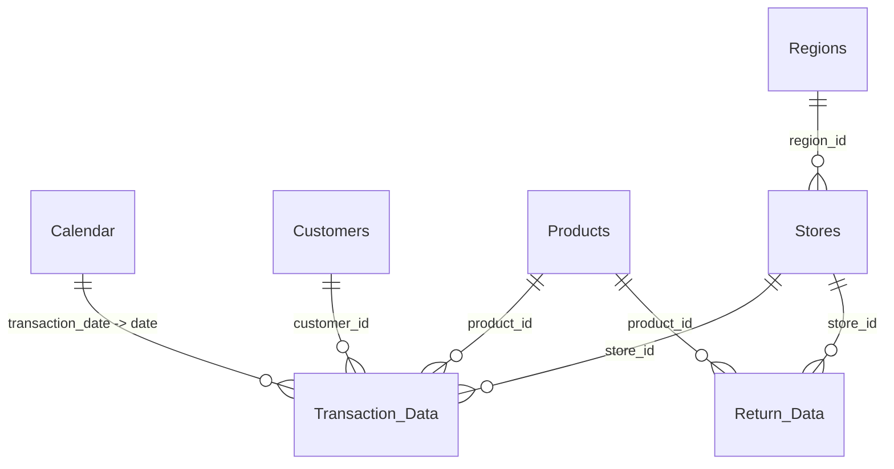

# 🛒 Walmart Market Business Intelligence Dashboard (USA • Mexico • Canada)

> **Created & Designed by [Aman Dwivedi](https://github.com/)**  
> *End-to-End Business Intelligence, Data Modeling, DAX Calculations & Interactive Web Analytics*

[](https://YOUR_GITHUB_USERNAME.github.io/YOUR_REPOSITORY_NAME/)
[](https://github.com/)
[](https://powerbi.microsoft.com/)
[](https://learn.microsoft.com/en-us/dax/)

---

## 📽️ Project Overview & Live Walkthrough

This project delivers an executive-level **Business Intelligence Dashboard** analyzing Walmart's cross-border retail performance across **Canada, Mexico, and the United States (1998)**.

- 🌐 **Live Web App / Demo**: [Click here for Live Interactive Dashboard](https://YOUR_GITHUB_USERNAME.github.io/YOUR_REPOSITORY_NAME/)
- 🎥 **Video Demo Walkthrough**: [Watch on Google Drive](https://drive.google.com/file/d/1KeaSngeepejP-b9MpzTiRgT_6mAvsQJD/view?usp=sharing) or view the included `DEMO VIDEO Power BI.mp4`.
- 📊 **Power BI Source File**: `Wallmart Market Report(Power BI).pbix`
- 📑 **Exported PDF Report**: `wallamart power bi dashboard.pdf`

---

## 🚀 How to Run on Localhost

You have multiple easy options to run this dashboard on your local machine:

### Option 1: One-Click Launcher (Windows)
Double-click `run_local.bat` in the project folder. It will start the server and open your browser automatically at `http://localhost:8000`.

### Option 2: Python Localhost Server
Open your terminal inside this folder and run:
```bash
python server.py
```
Or standard Python HTTP server:
```bash
python -m http.server 8000
```
Then visit: `http://localhost:8000` in your web browser.

### Option 3: Node.js / NPM
```bash
npm start
```

### Option 4: Direct Browser Open
Simply double-click `index.html` to open it in any modern browser (Chrome, Edge, Safari, Firefox).

---

## 🌐 How to Upload to GitHub & Deploy Live Demo (Step-by-Step)

Follow these simple steps to put this project on your GitHub with a 100% free, active **Live Demo URL**:

### Step 1: Initialize Git and Commit Your Files
Open your terminal / PowerShell in this folder and run:
```bash
# 1. Initialize git repository
git init

# 2. Add all project files
git add .

# 3. Commit the files
git commit -m "Initial commit: Walmart BI Dashboard by Aman Dwivedi"

# 4. Set default branch to main
git branch -M main
```

### Step 2: Create a New Repository on GitHub
1. Go to [GitHub](https://github.com/) and click **New Repository** (+ icon in top right).
2. Name the repository: `walmart-bi-dashboard` (or any name you prefer).
3. Keep it **Public** (required for free GitHub Pages).
4. Do NOT initialize with README/license (we already have them).
5. Click **Create repository**.

### Step 3: Link and Push to GitHub
Copy the repository URL and execute:
```bash
# Replace YOUR_USERNAME with your GitHub username
git remote add origin https://github.com/YOUR_USERNAME/walmart-bi-dashboard.git

# Push the code
git push -u origin main
```

### Step 4: Enable Free Live Demo via GitHub Pages
1. On your GitHub repository page, click **Settings** (top tab).
2. On the left sidebar under *Code and automation*, click **Pages**.
3. Under **Build and deployment** &rarr; **Source**, select **Deploy from a branch**.
4. Under **Branch**, select `main` and folder `/(root)`, then click **Save**.
5. Wait 1–2 minutes! GitHub will generate your live demo link:
   ```
   https://<YOUR_USERNAME>.github.io/walmart-bi-dashboard/
   ```
6. Add this live link to your GitHub repository's **About** description and README badge!

---

## 🔍 Key Dashboard Features

### 1. KPI Cards & Month-over-Month Benchmarking
- **Current Month Transactions**: `18,325` *(Target: 17,339 | +5.69%)*
- **Current Month Profit**: `$71,682` *(Target: $67,872 | +5.61%)*
- **Current Month Returns**: `496` *(Target: 482 | -2.90% alert)*
- **Total Revenue (FY 1998)**: `$449,627` *(Avg Margin: 59.94%)*

### 2. Product Brand Matrix (Top 30 Brands)
- Conditional Data Bars on Transaction Volumes.
- Dynamic Color-Scale formatting on Profit Margins (White to Green).
- Return Rate warning indicators (White to Red) identifying product quality anomalies.

### 3. Geographic Performance & Regional Drill-Down
- Interactive Leaflet Store Distribution Map (USA, Mexico, Canada).
- Treemap Breakdown: USA (*93.89K txns*), Mexico (*72.81K txns*), Canada (*12.77K txns*).
- Highlight Bookmark: **"📍 Portland hits 1,000 sales in December"**.

### 4. 52-Week Revenue Trending & Gauge Visual
- Column chart tracking 1998 weekly revenue cycles, highlighting Q4 holiday peaks ($40K+ / week).
- Revenue vs Target Gauge visualizing actuals ($120K) vs previous month target ($119.48K).

---

## 🏗️ Data Model (Star Schema)

The Power BI model is structured using an optimized Star Schema with 1-to-many relationships:



- **Fact Tables**: `Transaction_Data`, `Return_Data`
- **Dimension Tables**: `Calendar`, `Customers`, `Products`, `Stores`, `Regions`

---

## 📈 Top Business Insights

1. **Portland Milestone**: Portland store crossed 1,000 sales in December, leading Pacific regional performance.
2. **Top 10 Brands Pareto Rule**: The top 10 brands represent ~25% of gross revenue and achieve the highest gross margins (~60%).
3. **Return Rate Warning**: Returns increased by 2.9% in the current period, led by brands *Horatio (1.25%)* and *Nationeel (1.18%)*.
4. **Mexico Market Expansion**: Mexico demonstrated superior month-over-month profit velocity, representing a primary growth market for Walmart.

---

## 🛠️ Tech Stack & Skills

- **Business Intelligence**: Power BI Desktop, DAX, Power Query (M), Data Modeling, Star Schema
- **Web Analytics & Frontend**: HTML5, CSS3, JavaScript (ES6+), Tailwind CSS, Chart.js, Leaflet.js, Lucide Icons
- **Deployment**: GitHub Pages, Python `http.server`

---

## 👤 Author

**Aman Dwivedi**  
- Portfolio / BI Projects: [GitHub Profile](https://github.com/)  
- Email: Contact via GitHub  

*Special thanks to the open-source and Power BI community.*
